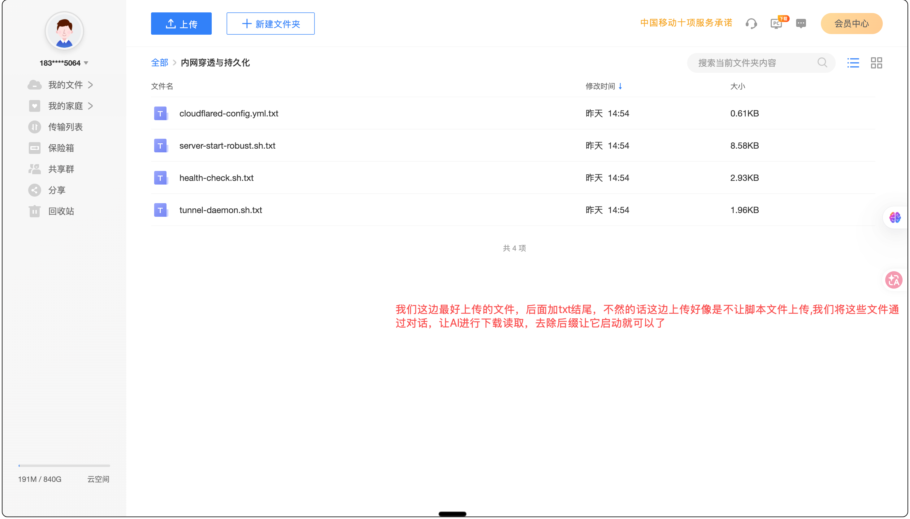
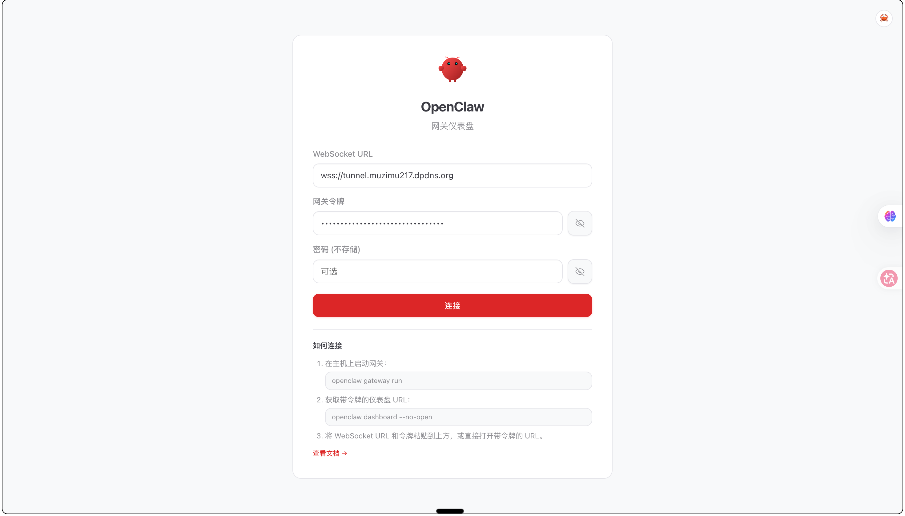
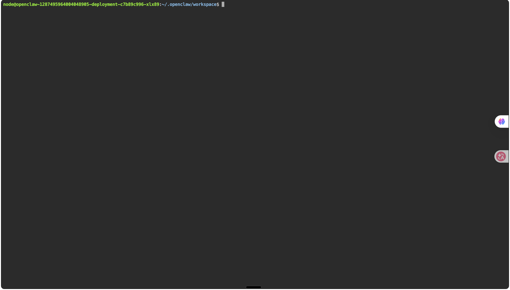

# MClaw 内网穿透配置包

**中国移动 MClaw 备份文件** 内网穿透配置，放入备份文件即可实现远程访问。同时支持**模型替换**自定义 AI。

---

## 核心功能

- ✅ **内网穿透** - Cloudflare Tunnel 远程访问 OpenClaw
- ✅ **进程守护** - 自动检测重启，持久化运行
- ✅ **网关令牌** - 自动获取并输出访问令牌
- ✅ **模型替换** - 通过备份还原方式替换内置模型
- ✅ **国内加速** - 使用 gh-proxy 镜像下载二进制文件
- ✅ **本地一键连接** - 服务器部署后，本地一条命令直连远程终端（无需浏览器）

---

## 本地一键连接（推荐）

服务器部署完成后，在**本地电脑**上即可像 SSH 一样直连远程终端。纯 Python 标准库实现，无任何依赖，macOS / Linux 开箱即用。

### 1. 配置服务器信息

```bash
cp connect.json.example connect.json
vi connect.json   # 填入你的域名、用户名、密码
```

### 2. 连接

```bash
./connect.sh myserver              # 交互式终端（Ctrl-] 退出，其余按键全部透传）
./connect.sh myserver "uptime"     # 执行单条命令，输出后退出
```

> 💡 网络受限的环境（如国内直连 Cloudflare 不稳）会在直连失败后自动尝试本机 `127.0.0.1:7897` HTTP 代理兜底，也可在 `connect.json` 中用 `proxy` 字段显式指定。

### 3. 首次部署到新服务器

```bash
# 上传配置包到服务器任意目录后：
cd remote
./server-start-robust.sh           # 自动下载依赖、启动隧道+终端+守护进程
```

> 🔒 **安全建议**：`openclaw / OpenClaw@2026` 是文档示例口令，且 ttyd 终端等同于服务器上运行脚本的用户的 shell。部署后请立即修改 `server-start-robust.sh` 和 `tunnel-daemon.sh` 中 `-c openclaw:OpenClaw@2026` 为你自己的强口令，再执行脚本。含真实密钥的 `openclaw-tunnel.json`、`connect.json` 已列入 `.gitignore`，切勿提交或分享。

---

> ⚠️ **【注意事项】** 在进行以下任何操作之前，请务必先在中国移动 APP 的 **MClaw（小龙虾）** 界面中 **多做几次备份！多做几次备份！** 以防操作失误导致数据丢失或配置异常，备份是最可靠的恢复手段。

> 💡 **【使用前必读】** 在正式操作之前，强烈建议先前往云服务器（如腾讯云 Cloud Studio：[ide.cloud.tencent.com](https://ide.cloud.tencent.com)）上进行测试验证，确保配置准确无误后再应用到 MClaw 中。云服务器测试命令：
>
> ```bash
> apt update && apt install -y wget curl procps
> cd remote
> ./server-start-robust.sh
> ```

---

## 使用方法

### 步骤 1：下载此配置包

点击右上角 **「Code」** → **「Download ZIP」** 下载，或：

```bash
git clone https://github.com/muzimu217/mclaw-remote-tunnel.git
```

### 步骤 2：下载 MClaw 备份文件（重点！）

1. 打开 **移动网盘** APP 或网页版
2. 进入你存放 OpenClaw 备份的路径
3. 找到刚刚备份的系统 zip 文件（文件名类似 `openclaw-xxx-时间戳.zip`）
4. **下载到本地**

⚠️ **注意事项**：
- 记住这个 zip 文件的**完整文件名**（包括前缀和时间戳）
- 记住这个 zip 文件存放的**路径位置**
- 后面打包和上传时必须完全一致！

### 步骤 3：解压备份并放入配置包

1. 解压下载的 zip 文件
2. 将此配置包（`remote` 文件夹）放入解压后的根目录：

```
openclaw-xxx-时间戳/          ← 解压后的根目录
├── agents/
├── devices/
├── remote/                   ← 放这里！根目录
│   ├── openclaw-tunnel.json
│   ├── cloudflared-config.yml
│   ├── server-start-robust.sh
│   └── README.md
├── workspace/
└── ...
```

### 步骤 4：配置 Tunnel（如需内网穿透）

#### 4.1 登录 Cloudflare

访问：**https://dash.cloudflare.com/** → 登录账号

#### 4.2 创建 Tunnel

1. 点击 **「Zero Trust」** → **「Networks」** → **「Tunnels」**
2. 点击 **「Create a tunnel」**
3. 选择 **「Cloudflared」**
4. 输入名称如 `openclaw-tunnel`，保存

#### 4.3 获取配置信息

创建后记录以下信息：

| 字段 | 位置 | 格式 |
|------|------|------|
| Tunnel ID | 页面顶部 | UUID 格式 |
| Account Tag | 点击「View configuration details」 | 32位字符 |
| Tunnel Secret | 创建时显示 | 长字符串（只显示一次！） |

#### 4.4 填入配置文件

**openclaw-tunnel.json**：
```json
{
  "AccountTag": "你的AccountTag",
  "TunnelID": "你的TunnelID",
  "TunnelName": "openclaw-tunnel",
  "TunnelSecret": "你的TunnelSecret"
}
```

**cloudflared-config.yml**：
```yaml
tunnel: 你的TunnelID
ingress:
  - hostname: 你的域名.com
    path: /terminal*
    service: http://localhost:7681
  ...
```

### 步骤 5：打包上传还原（重点！）

⚠️ **注意事项（非常重要）**：

1. **zip 包名一定要和下载的那个备份文件名一模一样！**
   - 下载的是 `openclaw-1287296976021332797-20260603120000.zip`
   - 打包时必须用完全相同的名字！

2. **上传到和下载备份包一样的路径**
   - 直接替换原本的包
   - 路径不一致会导致还原失败！

打包命令示例：
```bash
# 确保包名和原下载文件完全一致（示例）
zip -r openclaw-1287296976021332797-20260603120000.zip openclaw-1287296976021332797-20260603120000/
```

不过我希望各位在此实践之前，前往ide.cloud.tencent.com，将备份包上传到自己的云虚拟容器，先进行测试验证，通过之后再上传中国移动的：全部>AI空间>MClaw空间>MClaw备份（备份包名字一定要一致！！！）

### 更新邪修方法2


上传后在 MClaw 管理界面点击 **「还原系统」**。

---

### 更新邪修方法2：云盘直下法（推荐备份还原无效时使用）

> 部分成员反馈备份还原后配置未能生效，如果遇到这种情况，可以使用本方法。

#### 背景

通过对话让 AI 切换模型时，部分内置模型能力较弱，容易在对话过程中出现死机、重置等问题，导致模型替换失败。本方法的核心思路是：

1. **先让 AI 通过下载脚本包启动内网穿透**（避免大量对话消耗 token）
2. **再手动修改模型配置**（更安全、更可控）

#### 步骤

**1）将下载的配置包上传到云盘空间**

将本仓库下载的 ZIP 包解压后，上传到你的云盘空间（如中国移动云盘），确保文件可通过链接访问。

**2）让 MClaw AI 直接从云盘下载并启动**

在 MClaw 对话界面中，发送以下指令（⚠️ 一定要强调让 AI 从云盘下载，而不是本地操作）：

```
请帮我完成以下操作：
1. 从我的云盘空间下载 remote 配置包（链接：你的云盘链接）
2. 解压到 remote 目录
3. 执行 server-start-robust.sh 启动内网穿透
```



**3）等待内网穿透启动成功**

AI 会自动下载脚本、安装依赖并启动服务。启动成功后会获得访问地址。

**4）手动修改模型（可选）**

内网穿透启动后，通过 Web 终端手动编辑模型配置文件：

```bash
# 编辑模型配置
vi agents/main/agent/models.json
```

按照下方「模型替换」章节的说明，修改 `providers.router` 中的字段即可。

#### 优点

- ✅ 减少与 AI 的对话轮次，降低 token 消耗
- ✅ 避免因 AI 模型能力不足导致死机或重置
- ✅ 先通网络，再改模型，操作更安全可控

---

### 步骤 6：备份还原后发送给 AI 的指令（重点！）

系统还原完成后，你需要给 AI 发送以下指令来启动内网穿透服务：

#### 发送给 AI 的指令：

```
进入 remote 目录，执行 server-start-robust.sh 启动内网穿透
```

或者更详细的指令：

```
请帮我启动内网穿透服务：
1. 先安装依赖：apt update && apt install -y wget curl procps
2. 进入 remote 目录
3. 执行 ./server-start-robust.sh
```

#### AI 会自动执行：

1. 检查并安装前置依赖（wget、curl、procps）
2. 下载 ttyd 和 cloudflared 二进制文件（国内 gh-proxy 镜像）
3. 配置 Cloudflare Tunnel
4. 启动 Web 终端（端口 7681）
5. 启动 Tunnel 连接
6. **自动获取网关令牌并输出**

#### 验证启动成功：

AI 启动后，会输出类似以下内容：

```
==========================================
🔑 网关令牌 (Gateway Token)
==========================================

令牌: xxxxxx-xxxxx-xxxxx

Web 界面访问地址:
https://你的域名.com/chat?session=agent%3Amain%3Amain&token=xxxxxx
==========================================
```

**访问地址**：
- **Web 终端**: `https://你的域名.com/terminal/` （用户名: openclaw / 密码: OpenClaw@2026）
- **Web 界面**: `https://你的域名.com/chat?session=agent%3Amain%3Amain&token=你的令牌`

⚠️ **重要**：Web 界面需要令牌才能访问，AI 执行脚本后会自动输出令牌，请保存！


---

---

## 模型替换（可选）

想替换内置模型为 DeepSeek、MiMo、GPT 等，按以下步骤操作：

### 模型配置文件位置

```
agents/main/agent/models.json
```


### 替换方案

直接修改 `providers.router` 下的三个关键字段：

```json
{
  "providers": {
    "router": {
      "baseUrl": "https://api.deepseek.com/v1",    ← 改这里
      "apiKey": "你的API-Key",                      ← 改这里
      "api": "openai-completions",
      "models": [
        {
          "id": "deepseek-chat",                   ← 改这里
          "name": "deepseek-chat",                 ← 改这里
          "api": "openai-completions",
          "reasoning": false,                      ← 推理模型设为 true
          ...
        }
      ]
    }
  }
}
```

### 需要修改的字段

| 字段 | 说明 | 示例 |
|------|------|------|
| `baseUrl` | API 地址（OpenAI 兼容格式） | `https://api.deepseek.com/v1` |
| `apiKey` | 你的 API Key | `sk-xxx...` |
| `models[0].id` | 模型标识 | `deepseek-chat` |
| `models[0].name` | 模型名称 | `deepseek-chat` |
| `reasoning` | 推理模型开关 | `true`（如 DeepSeek-R1、MiMo） |

⚠️ **重要**：
- 不要新建 provider，就地替换 `router` 这个 provider 即可
- 其他字段（如 `api`、`input`、`contextWindow`）保持不变

### 支持的模型示例

| 模型 | baseUrl | reasoning |
|------|---------|-----------|
| DeepSeek Chat | `https://api.deepseek.com/v1` | `false` |
| DeepSeek R1 | `https://api.deepseek.com/v1` | `true` |
| MiMo v2.5 Pro | `https://token-plan-sgp.xiaomimimo.com/v1` | `true` |
| GPT-4o | `https://api.openai.com/v1` | `false` |
| 本地 Ollama | `http://localhost:11434/v1` | `false` |

---

## 人设替换（可选）

想自定义 AI 的性格、身份，修改以下文件：

| 文件 | 用途 |
|------|------|
| `workspace/SOUL.md` | 核心性格和行为规则 |
| `workspace/IDENTITY.md` | 名字、形象等身份信息 |
| `workspace/USER.md` | 用户偏好设置 |
| `workspace/AGENTS.md` | 工作空间指南 |

直接编辑这些 `.md` 文件，然后打包还原即可生效。

---

## 打包还原注意事项！！！！

只要 zip 包名和目录结构与原始备份一致，系统还原时能正常识别加载：

1. **包名一致** - 和下载时的 zip 文件名完全相同
2. **目录结构一致** - 顶层目录名也一致（如 `openclaw-1287296976021332797-20260603120000/`）
3. **上传路径一致** - 上传到移动网盘中和下载时相同的路径

---

## 配置信息获取总结

| 你需要的信息 | 获取地址 | 步骤 |
|-------------|---------|------|
| Cloudflare账号 | https://dash.cloudflare.com/ | 注册/登录 |
| Tunnel页面 | Networks → Tunnels | 创建 Tunnel |
| Tunnel ID | 页面顶部 | 直接复制 |
| Account Tag | 「View configuration details」 | 复制32位字符 |
| Tunnel Secret | 创建时一次性显示 | 立即保存 |

---

## 常见问题

### Q: zip 包名不一致会怎样？

还原会失败！系统找不到备份文件。必须保持文件名完全一致。

### Q: 上传路径不对会怎样？

还原时找不到文件。必须上传到和下载时完全相同的路径。

### Q: 网关令牌怎么获取？

脚本执行后会自动获取并输出。如果未显示，可在 Web 终端执行：
```bash
curl http://localhost:18789/api/token
```

### Q: 进程守护是什么？

脚本包含 `tunnel-daemon.sh` 守护进程，每 10 秒检查服务状态：
- ttyd 或 cloudflared 挂掉会自动重启
- 服务持久化运行，会话结束不影响

### Q: Tunnel Secret 找不到？

只显示一次。忘了就删除重建 Tunnel，这次立即复制！

---

## 致谢

感谢 [Linux.do](https://linux.do) 社区的支持与贡献：
- **JSW** — 信息资讯分享
- **Yumenosora** — 写给小白的MClaw的轮椅♿️教程分享


---

## 许可证

MIT License